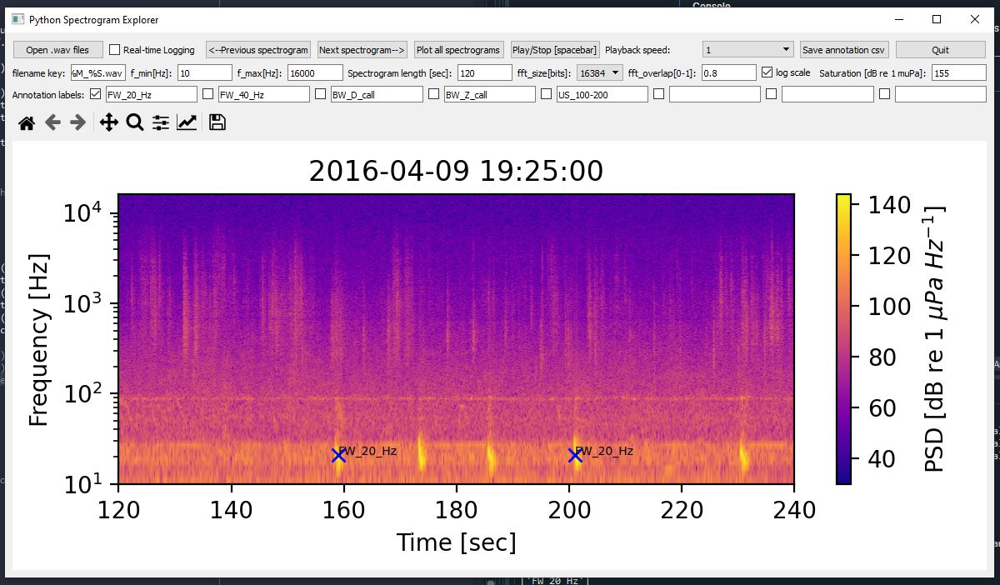
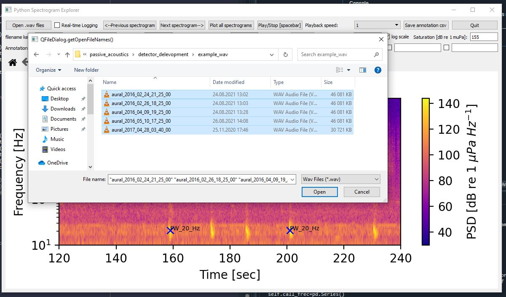

# Python Audio Spectrogram Explorer

### What you can do with this program:

- Visualize .wav files as spectrograms

- Navigate through the spectrograms and listen in (adjustable playback speeds)

- Annotate the spectrograms with custom labels and log each annotation's time-stamp and frequency 

- Export spectrograms as image files and automatically plot spectrograms for all selected files 

  

## How to install and start the program:
I have not yet compiled a standalone executable yet, so you will have to start the program using the python source code. To do so, install python 3 (ideally the latest Anaconda distribution) and download the file `python_audio_spectrogram_explorer.py`. Than open either the spyder IDE (or any other), open the downloaded python code and press the "run file" button (often a green play button). Now a graphical user interface (GUI) should open. 

Or from the command line, navigate to the folder that contains `python_audio_spectrogram_explorer.py` and start the program with this command: `python python_audio_spectrogram_explorer.py`. 

This program uses PyQT5 as GUI framework and numpy, scipy, pandas and matplotlib to manipulate and visualize the data. The module `simpleaudio` is used to playback sound. In case you are getting an error message due to a missing module, simply copy the module's name and install it using pip, for example `pip install simpleaudio`.

## How to use it:

### Open files with or without timestamps

To get started, you first have to decide if you want to use real time-stamps (year-month-day hour:minute:seconds) or not. For simply looking at the spectrograms and exploring your audio-files, you do not need the real time-stamps. But as soon as you want to annotate your data, the program needs to know when each .wav file started recording. The default is using real time-stamps. 

Without timestamps:
- Delete the content of the field "filename key:"    
- Press the "Open .wav files" button

With timestamps:
- The start date and time of each recoding should be contained in the .wav file name

- Adjust the "filename key:" field so that the program recognizes the correct time-stamp. For example: `aural_%Y_%m_%d_%H_%M_%S.wav`. Where %Y is year, %m is month, %d is day and so on.    

- Press the "Open .wav files" button and select your .wav files.

### Plot and browse spectrograms from .wav files
- Select the spectrogram setting of your choice:
    - Minimum and maximum frequency (y-axis) as f_min and f_max
    - Linear or logarithmic (default) frequency scale 
    - The length (x-axis) of each spectrogram in seconds. If the field is left empty the spectrogram will be the length of the entire .wav file. 
    - The FFT size determines the spectral resolution. The higher it is, the more detail you will see in the lower part of the spectrogram, with less detail in the upper part 
- Press next spectrogram (The Shortkey for this is the right arrow button)
- You can now navigate between the spectrograms using the "next/previous spectrogram" buttons or the left and right arrow keys. The time.stamp or filename of the current .wav file is displayed as title. 
- You can zoom and pan using the matplotlib toolbar, where you can also save the spectrogram as image file. 
- Once you have reached the final spectrogram, the program will display "That was it"
### Play audio and adjust playback speed
- Press the "Play/Stop" button or the spacebar to play the .wav file. This will play the sound currently visible in the spectrogram, also when zoomed in. 
- To listen to sound below or above the human hearing range, adjust the playback speed and press the Play button again.   

### Automatically plot spectrograms of multiple .wav files 

- Select your .wav files with the "Open .wav files" button
- Select the spectrogram settings of your choice
- Press the "Plot all spectrograms" button and confirm the pop-up question
- The spectrograms will be saved as .jpg files with the same filename and location as your .wav files. 

### Annotate the spectrograms

- Make sure the "filename key" field contains the correct time-stamp information

- Now you can either choose to log you annotations in real time or save them later. I recommend using the "real-time logging" option. 

- Press the "real-time logging" check-box. Now the program will look if there are already log files existing for each .wav file. Log files are named by adding "_log.csv" to the .wav filename, for example "aural_2017_02_12_22_40_00_log.csv". You can choose to overwrite these log files. If you do not choose to overwrite them, the program ignores .wav files that already have and existing log file. This is useful if you want to work on a dataset over several sessions. 

- Now you can choose custom (or preset) labels for your annotations by changing the labels in the row "Annotation labels". If no label is selected (using the check-boxes) an empty string will be used as label. 

- To set an annotation, double left-click at any location inside the spectrogram plot 

- To remove the last annotation, click the right mouse button. 

- Once a new .wav file is opened, the annotations for the previous .wav file are saved as .csv file, for example  as "aural_2017_02_12_22_40_00_log.csv". If no annotations were set an empty table is saved. This indicates you have already screened this .wav file but found nothing to annotate. 

- The "...._log.csv" files are formated like this:

|      | Timestamp                  | Frequency          | Label     |
| ---- | -------------------------- | ------------------ | --------- |
| 0    | 2016-04-09 19:25:47.491291 | 17.313106985840445 | FW_20_Hz  |
| 1    | 2016-05-10 17:36:13.940731 | 27.59109213794827  | BW_Z_call |
| 2    | 2016-04-09 19:28:21.889267 | 23.329589392071576 | FW_20_Hz  |

- If you want to save you annotations separately, press the "Save annotation csv" button