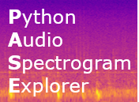
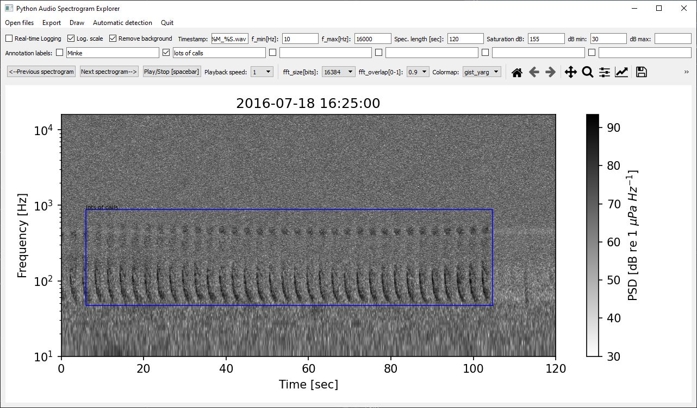
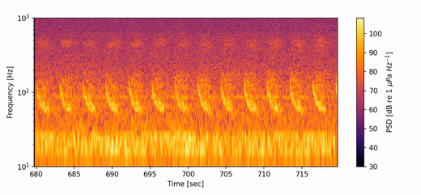
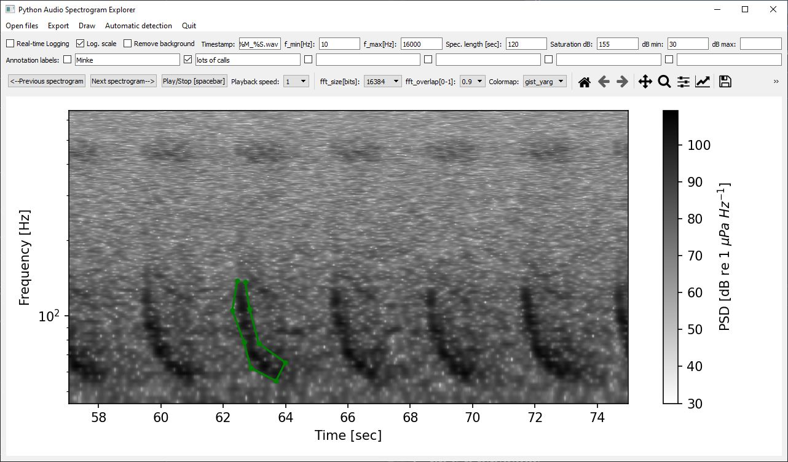
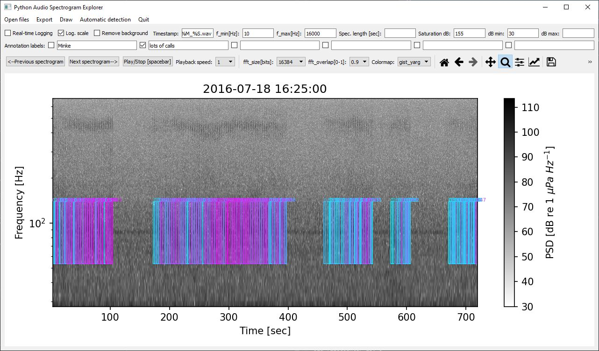
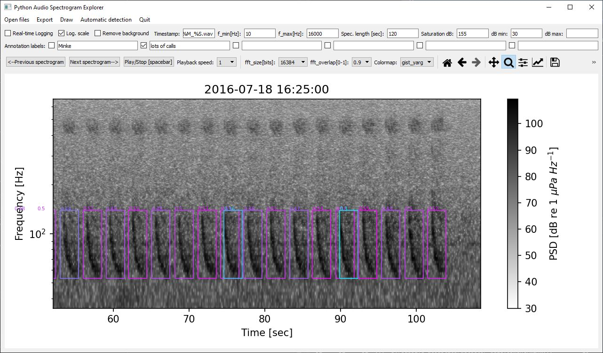

# Python Audio Spectrogram Explorer (PASE)
[](https://zenodo.org/badge/latestdoi/403931857)

### What you can do with this program:

- Visualize audio files as spectrograms

- Navigate through the spectrograms and listen in to selected areas in the spectrogram (adjustable playback speeds)

- Export selected area in the spectrogram as .wav file, .csv table or .mp4 video 

- Annotate areas in the spectrograms with custom labels and log each annotation's time-stamp and frequency 

- Export spectrograms as image files and automatically plot spectrograms for all selected files 

- Draw shapes in the spectrogram and save them as .csv file 

- Automatically detect signals using spectrogram correlation or shapematching

  

## How to install and start the program:
You can either download the windows executable (found here under "Release" and "PASE") or start the program using the python source code. The windows executable is included in this release, it cannot be used to export videos but has all the other functions.

A platform independent way to start the program is run the source code directly in python. To download PASE use this command:

```python
pip install pase
```

Than open a python console and start PASE with these two commands:

```python
import pase
pase.pase.start()
```

This program uses PyQT5 as GUI framework and numpy, scipy, pandas and matplotlib to manipulate and visualize the data. The module `simpleaudio` is used to playback sound and `moviepy` to generated videos. In case you are getting an error message due to a missing module, simply copy the module's name and install it using pip, for example `pip install simpleaudio` and `pip install soundfile`.

## How to use it:

### Open files with or without timestamps

The currently supported audio file types are: .wav .aif .aiff .aifc .ogg .flac

To get started, you first have to decide if you want to use real time-stamps (year-month-day hour:minute:seconds) or not. For simply looking at the spectrograms and exploring your audio-files, you do not need the real time-stamps. But as soon as you want to annotate your data, the program needs to know when each .wav file started recording based on the file names. The default is using real time-stamps. 

**Without timestamps:**

- Delete the content of the field "Timestamp:"    
- Press the "Open files" button in the Menu

**With timestamps:**

- The start date and time of each recoding should be contained in the audio file name

- Adjust the "Timestamp:" field so that the program recognizes the correct time-stamp. For example: `aural_%Y_%m_%d_%H_%M_%S.wav` or `%y%m%d_%H%M%S_AU_SO02.wav` Where %Y is year, %m is month, %d is day and so on.   Here is a list of the format strings:

  | **Directive** | **Meaning**                                                  | **Example**              |
  | ------------- | ------------------------------------------------------------ | ------------------------ |
  | `%a`          | Abbreviated weekday name.                                    | Sun, Mon, ...            |
  | `%A`          | Full weekday name.                                           | Sunday, Monday, ...      |
  | `%w`          | Weekday as a decimal number.                                 | 0, 1, ..., 6             |
  | `%d`          | Day of the month as a zero-padded decimal.                   | 01, 02, ..., 31          |
  | `%-d`         | Day of the month as a decimal number.                        | 1, 2, ..., 30            |
  | `%b`          | Abbreviated month name.                                      | Jan, Feb, ..., Dec       |
  | `%B`          | Full month name.                                             | January, February, ...   |
  | `%m`          | Month as a zero-padded decimal number.                       | 01, 02, ..., 12          |
  | `%-m`         | Month as a decimal number.                                   | 1, 2, ..., 12            |
  | `%y`          | Year without century as a zero-padded decimal number.        | 00, 01, ..., 99          |
  | `%-y`         | Year without century as a decimal number.                    | 0, 1, ..., 99            |
  | `%Y`          | Year with century as a decimal number.                       | 2013, 2019 etc.          |
  | `%H`          | Hour (24-hour clock) as a zero-padded decimal number.        | 00, 01, ..., 23          |
  | `%-H`         | Hour (24-hour clock) as a decimal number.                    | 0, 1, ..., 23            |
  | `%I`          | Hour (12-hour clock) as a zero-padded decimal number.        | 01, 02, ..., 12          |
  | `%-I`         | Hour (12-hour clock) as a decimal number.                    | 1, 2, ... 12             |
  | `%p`          | Locale’s AM or PM.                                           | AM, PM                   |
  | `%M`          | Minute as a zero-padded decimal number.                      | 00, 01, ..., 59          |
  | `%-M`         | Minute as a decimal number.                                  | 0, 1, ..., 59            |
  | `%S`          | Second as a zero-padded decimal number.                      | 00, 01, ..., 59          |
  | `%-S`         | Second as a decimal number.                                  | 0, 1, ..., 59            |
  | `%j`          | Day of the year as a zero-padded decimal number.             | 001, 002, ..., 366       |
  | `%-j`         | Day of the year as a decimal number.                         | 1, 2, ..., 366           |

- Press the "Open files" button and select your audio files with the dialogue.

### Plot and browse spectrograms 
- Select the spectrogram setting of your choice:
    - Minimum and maximum frequency (y-axis) as f_min and f_max
    - Linear or logarithmic (default) frequency scale 
    - The length (x-axis) of each spectrogram in seconds. If the field is left empty the spectrogram will be the length of the entire .wav file. 
    - The FFT size determines the spectral resolution. The higher it is, the more detail you will see in the lower part of the spectrogram, with less detail in the upper part 
    - The minimum and maximum dB values for the spectrogram color, will be determined automatically if left empty
    - The colormap from a dropdown menu, below are examples for the black and white colormap called "gist_yarg".

- Press next spectrogram (The Shortkey for this is the right arrow button)
- You can now navigate between the spectrograms using the "next/previous spectrogram" buttons or the left and right arrow keys. The time-stamp or filename of the current audio file is displayed as title. 
- You can zoom and pan using the magnifying glass symbol in the matplotlib toolbar, where you can also save the spectrogram as image file (square save button). 
- Once you have reached the final spectrogram, the program will display a warning

### Play audio and adjust playback speed, export the selected sound as .wav
- Press the "Play/Stop" button or the spacebar to play the current selection of your audio file.
- The program will only play what is visible in the current spectrogram (Sound above and below the frequency limits is filtered out)
- To listen to specific sounds, zoom in using the magnifying glass
- To listen to sound below or above the human hearing range, adjust the playback speed and press the "Play" button again.   
- To export the sound you selected as .wav file, press  "Export" in the Menu and selected "Spectrogram as .wav file"

### Automatically plot spectrograms of multiple .wav files 

- Select your audio files with the "Open files" button
- Select the spectrogram settings of your choice
- Press  "Export" in the Menu and select "All files as spectrogram images"
- The spectrograms will be saved as .jpg files with the same filename and location as your .wav files. 

### Annotate the spectrograms

- Make sure the "filename key" field contains the correct time-stamp information

- Now you can either choose to log you annotations in real time or save them later. I recommend using the "real-time logging" option. 

- Press the "real-time logging" check-box. Now the program will look if there are already log files existing for each audio file. Log files are named by adding "_log.csv" to the .wav filename, for example "aural_2017_02_12_22_40_00_log.csv". You can choose to overwrite these log files. If you do not choose to overwrite them, the program ignores audio files that already have an existing log file. This is useful if you want to work on a dataset over several sessions. 

- Now you can choose custom (or preset) labels for your annotations by changing the labels in the row "Annotation labels". If no label is selected (using the check-boxes) an empty string will be used as label. 

- To set an annotation, left-click at any location inside the spectrogram plot and draw a rectangle over the region of interest

- To remove the last annotation, click the right mouse button. 

- Once a new .wav file is opened, the annotations for the previous .wav file are saved as .csv file, for example  as "aural_2017_02_12_22_40_00_log.csv". If no annotations were set an empty table is saved. This indicates you have already screened this .wav file but found nothing to annotate. 

- The "...._log.csv" files are formated like this (t1,f1 and t2,f2 are the corners of the annotation box):

|      | t1       |   t2   |       f1       | f2          | Label             |
| ---- | ------------------  | ---------------|------- | ----|--- |
| 0    | 2016-04-09 19:25:47.49 |2016-04-09 19:25:49.49  | 17.313 | 20.546   | FW_20_Hz  |
| 1    | 2016-05-10 17:36:13.94 | 2016-05-10 17:38:13.94 | 27.59109  | 34.57 | BW_Z_call |

- If you want to save your annotations separately, press "Export" in the menu and choose "Annotations as .csv table" 

### Remove the background from spectrogram

This feature can be useful to detect sounds hidden in background noise. It subtracts the average spectrum from the current spectrogram, so that the horizontal noise lines and slope in background noise disappear. To active this function toggle the checkbox called "Remove background".  For optimal use, test different dB minimum setting. Here is an example for the spectrogram shown above:



### Animated spectrogram videos

You can use the python console based version of PASE to generate a video (.mp4 files) of the spectrogram with a moving bar. Here is an example:



With sound: https://youtu.be/x3_kFesvw5I

- zoom into the desired area of the spectrogram and press "Export" in the menu and select "Spectrogram as animated video"
- Wait while the video is generated (might take a few minutes depending on the spectrogram size)

### Draw shape and export as .csv file



- Press the "Draw" button in the menu

- now you can draw a line by adding points with a double left click and removing them with a right click

- to save the shape as .csv file and exit the drawing mode press ENTER

- now you are back in the normal annotation mode
  
- the .csv file is structured as follows:

|      | Time_in_s | Frequency_in_Hz |
| ---- | --------- | --------------- |
| 0    | 49.273229 | 171.060302      |
| 1    | 49.224946 | 166.780047      |
| 2    | 49.221929 | 147.346955      |

### Automatic signal detection

You can use two automatic detections methods to detect sounds that are very similar to a selected template:

**Shapematching** https://github.com/sebastianmenze/Marine-mammal-call-detection-using-spectrogram-shape-matching

- Draw a template shape based on an example signal and save the .csv file (example for a minke whale calls shown above)

- Press "Automatic detection" in the menu an select shapematching (on either the current or all audio files)
- load the template (.csv file) of your choice
- select a signal-to-noise dB threshold, usually between 3 and 10 dB, depending on the strength of the signal and amount of noise 
- The spectrogram will now display the bounding boxes of detected signals, with the score displayed in the upper left corners
- You can export the automatic detections (including some more metadata) as .csv file in the "Export" menu under "Automatic detections as .csv file"
- To clear the automatic detections, press any of the "Automatic detection"  buttons but than press "Cancel" instead of opening a template file

or **Spectrogram correlation** https://github.com/sebastianmenze/Spectrogram-correlation-tutorial

- Here the template can either be a shape or a 2-D image table
- To use a shape, use the "draw" mode and save the .csv file (example for a minke whale calls shown above)

- To use a 2-D table, zoom into the spectrogram so your selection contains only the desired signal and press "Export" in the menu and select "Spectrogram as .csv table"
- To start the automatic detections, press "Automatic detection" in the menu and select spectrogram correlation (on either the current or all audio files)
- Select a template .csv file (shape or table)
- Choose a detection threshold (correlation score r between 0 and 1)

- The spectrogram will now display the bounding boxes of detected signals, with the score displayed in the upper left corners
- You can export the automatic detections including some more metadata as .csv file using the "Export auto-detec" button
- To clear the automatic detections, press any of the "Automatic detection"  buttons but than press "Cancel" instead of opening a template file

Here is an example for the Ant. Minke whale calls:

Example result for the shapematching:


Example result for the spectrogram correlation:



